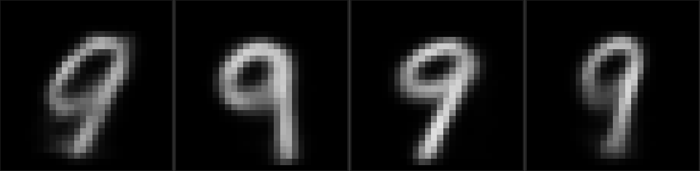
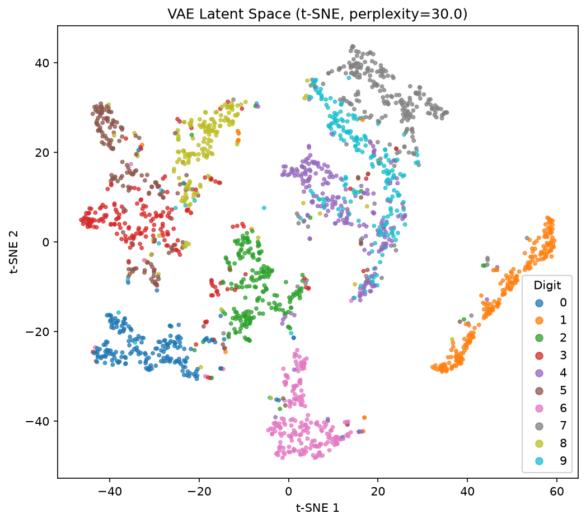

# mentats

A neural network library built from scratch in Rust, designed to understand deep learning fundamentals through implementation.

## Overview

mentats is an educational framework implementing core neural network operations without external libraries. Every operation is implemented from first principles.

**Current Milestone:** Conditional VAE (CVAE) on MNIST, generates digits of a chosen class from a random latent vector, using free-bits KL to avoid posterior collapse



---

**Previous Milestone:** Unconditional MNIST VAE with 10 latent dimensions, free bits and per-batch annealing. Latent space shows per-digit structure without collapsed dimensions

t-SNE preserves the local neighbourhood structure and gives clearer visual on the cluster seperation than the PCA of the 10 dimension latent space



**Earlier Milestone:** MNIST classification at **97.43%** accuracy with a simple feed-forward network.

---

## Results

**Initial loss: 2.4407463**

| Epoch | Loss   | Train Accuracy | Elapsed Time (s) |
| ----- | ------ | -------------- | ---------------- |
| 0     | 0.2634 | 92.48%         | 41.86693635      |
| 1     | 0.1167 | 96.55%         | 41.962896705     |
| 2     | 0.0797 | 97.66%         | 41.903314238     |
| 3     | 0.0594 | 98.16%         | 41.835316543     |
| 4     | 0.0466 | 98.57%         | 41.93213144      |

**Test accuracy: 97.43%**

---

## Network Architecture

**Classifier**

```
Input (784)
  └─ LinearLayer (784 → 128)
  └─ ReLU
  └─ LinearLayer (128 → 10)
  └─ Softmax (implicit via cross-entropy loss)
```

Trained with SGD, learning rate `0.01`, categorical cross-entropy loss, 5 epochs over the full 60,000 training examples.

**VAE (unconditional)**

```
Encoder: 784 → 512 → ReLU → 256 → ReLU → 20 (mu, log_var; latent_dim=10)
Sampler: reparameterization trick, z = mu + exp(0.5*log_var) * eps
Decoder: 10 → 256 → ReLU → 512 → ReLU → 784
```

Trained with Adam, binary cross-entropy reconstruction loss + free-bits KL divergence, beta annealed per-batch from 0 to 1 over the first 20 epochs.

**CVAE (conditional)**

```
Encoder: (784 + 10 one-hot label) → 512 → ReLU → 256 → ReLU → 64 (mu, log_var; latent_dim=32)
Sampler: reparameterization trick
Decoder: (32 + 10 one-hot label) → 256 → ReLU → 512 → ReLU → 784
```

Same loss setup as the unconditional VAE; label is concatenated onto both encoder and decoder input so generation can be conditioned on a target digit class.

---

## Project Structure

```
data/
├── mnist/
│   ├── train-images.idx3-ubyte
│   ├── ...
checkpoints/
├── mnist_classifier.rmlc
├── cvae_encoder.rmlc
├── cvae_decoder.rmlc
src/
├── bin/
|   └── pgm2png.rs # pgm converter (VAE output)
├── data/
│   ├── mnist.rs # Load images and labels
│   ├── mod.rs
├── loss /
│   ├── cross_entropy.rs
│   ├── mse.rs # mean squared error
|   ├── kl_divergence.rs # KL divergence + free-bits gradients
│   ├── mod.rs
├── tensor/
│   ├── core.rs   # Tensor struct and core operations
│   ├── ops.rs
│   ├── init.rs     # Weight initialisation
|   ├── batch_ops.rs # Batched matmul
│   └── mod.rs
├── nn/
│   ├── activation.rs  # ReLU, sigmoid, tanh (ActivationKind enum)
|   ├── flatten.rs
|   ├── init.rs # Xavier
│   ├── linear.rs      # LinearLayer (forward pass, backward pass, sgd_update)
│   ├── network.rs # Collection of network layers
|   ├── reshape.rs
|   ├── sampling.rs # GaussianSampled (VAE reparameterisation)
│   ├── softmax.rs # Softmax function
│   └── mod.rs
├── optimiser/
|   ├── adam.rs
|   └── mod.rs
├── utils /
|   ├── batch.rs
|   ├── checkpoint.rs
|   ├── grad_check.rs
|   ├── image.rs # u8 to grayscale
|   ├── mod.rs 
|   ├── model_io.rs # model saving and loading
|   ├── vae.rs # vae functions
├── lib.rs
examples/
│   ├── xor.rs
│   ├── mnist.rs
│   ├── basics.rs
|   ├── cvae_mnist.rs
|   ├── vae_mnist.rs
└──────
```

---

## Getting the Data

The MNIST binary files are not included in this repo. Download them from the [Kaggle MNIST dataset](https://www.kaggle.com/datasets/hojjatk/mnist-dataset), and place them in `data/mnist/`:

```
data/mnist/train-images.idx3-ubyte
data/mnist/train-labels.idx1-ubyte
data/mnist/t10k-images.idx3-ubyte
data/mnist/t10k-labels.idx1-ubyte
```

---

## What's Implemented

**Tensor (`src/tensor/`)**

- Flat `Vec<f32>` storage, supports 2D `[features, 1]` and 3D `[batch, features, 1]` shapes
- `from_vec`, `map`, `zip_map`, `scale`, `add`, `sub`
- `concat_features_2d` / `concat_features_batch`, feature-dim concatenation (used for CVAE label conditioning)
- `take_first_features_batch`, slice gradients back out after concatenation
- `matmul`, cache-friendly i-k-j loop order

**Activation functions (`src/nn/activation.rs`)**

- ReLU, sigmoid, tanh, identified by an `ActivationKind` enum (not function-pointer comparison — unreliable under release-build identical code folding)

**LinearLayer (`src/nn/linear.rs`)**

- Weight shape: `(out_features × in_features)`
- Xavier-uniform initialisation
- `forward(&input)` computes `W·x + b`, supports batched 3D input

**Network (`src/nn/network.rs`)**

- Stores a vector of layers (`Vec<Box<dyn Layer>>`)
- Forward, backward, update

**GaussianSampler (`src/nn/sampling.rs`)**

- Reparameterization trick: `z = mu + sigma * eps`, `sigma = exp(0.5 * log_var)`
- Fresh `eps` sampled every forward pass (Box-Muller transform, no external RNG distribution needed)

**KL Divergence (`src/loss/kl_divergence.rs`)**

- Standard closed-form Gaussian KL to N(0, 1) prior, summed per dimension then meaned over batch
- Free-bits clamping (`tau = 0.5` nats/dim), dimensions under threshold contribute zero loss and zero gradient, preventing posterior collapse

## Dependencies

```toml
[dependencies]
rand = "0.8"
```

`rand` is the only external crate, used for weight initialisation.
Everything else is standard library.

## Running

```shell
cargo run --example basics
cargo run --example xor
cargo run --example mnist
cargo run --example vae_mnist --release
cargo run --example cvae_mnist --release
cargo run --example cvae_mnist -- generate <class 0-9> [count]
cargo test
```

## Design Notes

- Weights are `(out × in)` — consistent with the convention that `forward` computes `W·x`, where `x` is a column vector.
- `matmul` uses i-k-j loop order intentionally for cache performance; don't reorder.
- Tests use `Matrix::from_vec` with known values and epsilon comparison — no random inputs in correctness tests.
