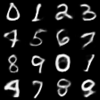
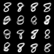

# mentats

A neural network library built from scratch in Rust, designed to understand deep learning fundamentals through implementation.

## Overview

mentats is an educational framework implementing core neural network operations without external libraries. Every operation is implemented from first principles.

**Current Milestone:** Convolutional Conditional VAE (CNN VAE) on MNIST. Combines the convolutional feature extraction with nearest neighbour upsampling and convolutional decoding to generate class defined digits ($0\rightarrow 9$) from random latent vectors $z \sim \mathcal{N}(0, I)$

<p align="center">


</p>

_(Left: 4x4 class-conditioned generation showcase covering classes 0–9; Right: 16 distinct styles of digit 8 sampled across the latent space showing stroke variations)_

**Previous Milestone:** Convolutional classification on MNIST at **97.69%** accuracy

**Earlier Milestone:** Conditional VAE (CVAE) on MNIST, generates digits of a chosen class from a random latent vector, using free-bits KL to avoid posterior collapse


---

**Earlier Milestone:** Unconditional MNIST VAE with 10 latent dimensions, free bits and per-batch annealing. Latent space shows per-digit structure without collapsed dimensions

t-SNE preserves the local neighbourhood structure and gives clearer visual on the cluster seperation than the PCA of the 10 dimension latent space


**Earlier Milestone:** MNIST classification at **97.43%** accuracy with a simple feed-forward network.

---

## Results

### Convolutional network

**Initial loss: 1.7083912**

| Epoch | Loss   | Train Accuracy | Elapsed Time (s) |
| ----- | ------ | -------------- | ---------------- |
| 0     | 0.1477 | 95.70%         | 116.1743845      |
| 1     | 0.0758 | 97.79%         | 132.8015859      |
| 2     | 0.0631 | 98.19%         | 135.2815806      |
| 3     | 0.0564 | 98.40%         | 155.8238239      |
| 4     | 0.0518 | 98.58%         | 125.2507541      |

**Test accuracy: 97.69%**

### Simple feed-forward network

**Initial loss: 2.4407463**

| Epoch | Loss   | Train Accuracy | Elapsed Time (s) |
| ----- | ------ | -------------- | ---------------- |
| 0     | 0.2634 | 92.48%         | 41.86693635      |
| 1     | 0.1167 | 96.55%         | 41.962896705     |
| 2     | 0.0797 | 97.66%         | 41.903314238     |
| 3     | 0.0594 | 98.16%         | 41.835316543     |
| 4     | 0.0466 | 98.57%         | 41.93213144      |

**Test accuracy: 97.43%**

---

## Network Architecture

**CNN CVAE (Convolutional Conditional VAE)**

- **Convolutional Encoder**:

```
Input (784)
  └─ ReshapeLayer ([1, 28, 28])
  └─ Conv2DLayer (1 → 16 channels, 3x3 kernel, Kaiming normal)
  └─ ReLU
  └─ MaxPool2DLayer (2x2 pool, stride 2)
  └─ FlattenLayer (16 x 13 x 13 → 2704)
```

- **Convolutional Decoder**:

```
Concat [Latent z (10), One-Hot Label (10)]
  └─ LinearLayer (20 → 16 x 7 x 7 = 784)
  └─ ReshapeLayer ([16, 7, 7])
  └─ ReLU
  └─ Upsample2DLayer (2x nearest-neighbor → [16, 14, 14])
  └─ Pad2DLayer (pad 1 → [16, 16, 16])
  └─ Conv2DLayer (16 → 16 channels, 3x3)
  └─ ReLU
  └─ Upsample2DLayer (2x nearest-neighbor → [16, 32, 32])
  └─ Pad2DLayer (pad 1 → [16, 34, 34] → cropped/convolved to [16, 28, 28])
  └─ Conv2DLayer (16 → 8 channels, 3x3)
  └─ ReLU
  └─ Pad2DLayer (pad 1)
  └─ Conv2DLayer (8 → 1 channel, 3x3)
  └─ FlattenLayer (784)
```

**CNN Classifier**

```
Input (784)
  └─ ReshapeLayer ([1, 28, 28])
  └─ Conv2DLayer (1 → 8 feature maps, 3x3 kernel, Kaiming normal)
  └─ ReLU
  └─ MaxPool2DLayer (2x2 pool, stride 2)
  └─ FlattenLayer (8 x 13 x 13 → 1352)
  └─ LinearLayer (1352 → 10)
  └─ Softmax (implicit via cross-entropy loss)
```

**Classifier**

```
Input (784)
  └─ LinearLayer (784 → 128)
  └─ ReLU
  └─ LinearLayer (128 → 10)
  └─ Softmax (implicit via cross-entropy loss)
```

Trained with SGD, learning rate `0.01`, categorical cross-entropy loss, 5 epochs over the full 60,000 training examples.

**VAE (unconditional)**

```
Encoder: 784 → 512 → ReLU → 256 → ReLU → 20 (mu, log_var; latent_dim=10)
Sampler: reparameterization trick, z = mu + exp(0.5*log_var) * eps
Decoder: 10 → 256 → ReLU → 512 → ReLU → 784
```

Trained with Adam, binary cross-entropy reconstruction loss + free-bits KL divergence, beta annealed per-batch from 0 to 1 over the first 20 epochs.

**CVAE (conditional)**

```
Encoder: (784 + 10 one-hot label) → 512 → ReLU → 256 → ReLU → 64 (mu, log_var; latent_dim=32)
Sampler: reparameterization trick
Decoder: (32 + 10 one-hot label) → 256 → ReLU → 512 → ReLU → 784
```

Same loss setup as the unconditional VAE; label is concatenated onto both encoder and decoder input so generation can be conditioned on a target digit class.

---

## Project Layout

- `src/tensor/` - N-dimensional tensor implementation, strides, and memory layouts.
- `src/matrix/` - 2D matrix primitives and BLAS-like operations.
- `src/nn/` - Layers (Linear, Conv2D, MaxPool2D, Upsample2D, Pad2D, Activations, Sampler).
- `src/loss/` - Loss functions (Cross-Entropy, BCE, MSE, Free-bits KL divergence).
- `src/optimiser/` - Optimisers (Adam, SGD).
- `examples/` - End-to-end runnable models (CNN classifier, VAE, CVAE).
- `tests/` - Numerical and gradient integration tests.

---

## Getting the Data

The MNIST binary files are not included in this repo. Download them from the [Kaggle MNIST dataset](https://www.kaggle.com/datasets/hojjatk/mnist-dataset), and place them in `data/mnist/`:

```
data/mnist/train-images.idx3-ubyte
data/mnist/train-labels.idx1-ubyte
data/mnist/t10k-images.idx3-ubyte
data/mnist/t10k-labels.idx1-ubyte
```

---

## What's Implemented

**Tensor (`src/tensor/`)**

- Flat `Vec<f32>` storage, supports 2D `[features, 1]` and 3D `[batch, features, 1]` shapes
- `from_vec`, `map`, `zip_map`, `scale`, `add`, `sub`
- `concat_features_2d` / `concat_features_batch`, feature-dim concatenation (used for CVAE label conditioning)
- `take_first_features_batch`, slice gradients back out after concatenation
- `matmul`, cache-friendly i-k-j loop order

**Activation functions (`src/nn/activation.rs`)**

- ReLU, sigmoid, tanh, identified by an `ActivationKind` enum (not function-pointer comparison - unreliable under release-build identical code folding)

**LinearLayer (`src/nn/linear.rs`)**

- Weight shape: `(out_features x in_features)`
- Xavier-uniform initialisation
- `forward(&input)` computes `W·x + b`, supports batched 3D input

**Network (`src/nn/network.rs`)**

- Stores a vector of layers (`Vec<Box<dyn Layer>>`)
- Forward, backward, update

**GaussianSampler (`src/nn/sampling.rs`)**

- Reparameterisation trick: `z = mu + sigma * eps`, `sigma = exp(0.5 * log_var)`
- Fresh `eps` sampled every forward pass (Box-Muller transform, no external RNG distribution needed)

**KL Divergence (`src/loss/kl_divergence.rs`)**

- Standard closed-form Gaussian KL to N(0, 1) prior, summed per dimension then meaned over batch
- Free-bits clamping (`tau = 0.5` nats/dim), dimensions under threshold contribute zero loss and zero gradient, preventing posterior collapse

**Conv2DLayer (`src/nn/conv.rs`)**

- Valid 2D cross correlation over multi channel tensors
- Kaiming normal initialisation

**MaxPool2DLayer (`src/nn/pooling.rs`)**

- 2D downsampling with sub window sliding
- Cached `(row, col)` `argmax` tracking

**Upsample2DLayer (`src/nn/upsample.rs`)**

- 2D nearest-neighbour spatial upsampling

**Pad2DLayer (`src/nn/padding.rs`)**

- 2D zero-padding for convolutional spatial preservation

## Dependencies

```toml
[dependencies]
rand = "0.8"
```

`rand` is the only external crate, used for weight initialisation.
Everything else is standard library.

## Running

```shell
cargo run --example basics
cargo run --example xor
cargo run --example mnist
cargo run --example cnn_mnist --release
cargo run --example vae_mnist --release
cargo run --example cvae_mnist --release
cargo run --example cvae_mnist -- generate <class 0-9> [count]
cargo run --example cnn_vae --release
cargo run --example cnn_cvae --release
cargo run --example cnn_cvae --release -- generate <digit 0-9> [count]
cargo test
```

## Design Notes

- Weights are `(out x in)` - consistent with the convention that `forward` computes `W·x`, where `x` is a column vector.
- `matmul` uses i-k-j loop order intentionally for cache performance; don't reorder.
- Tests use `Matrix::from_vec` with known values and epsilon comparison - no random inputs in correctness tests.
